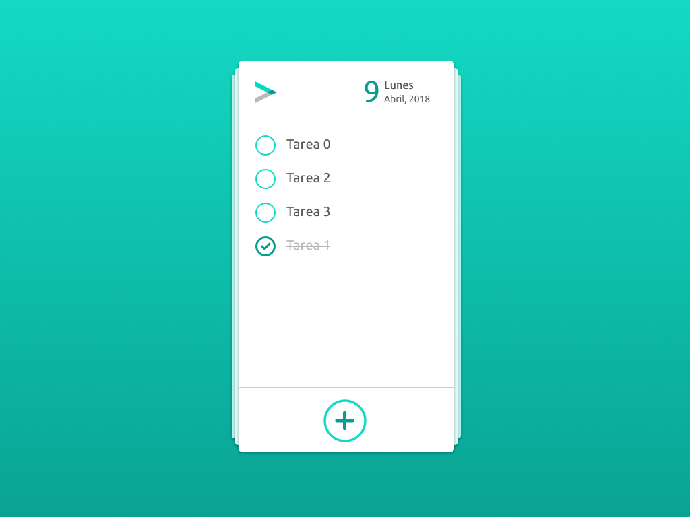
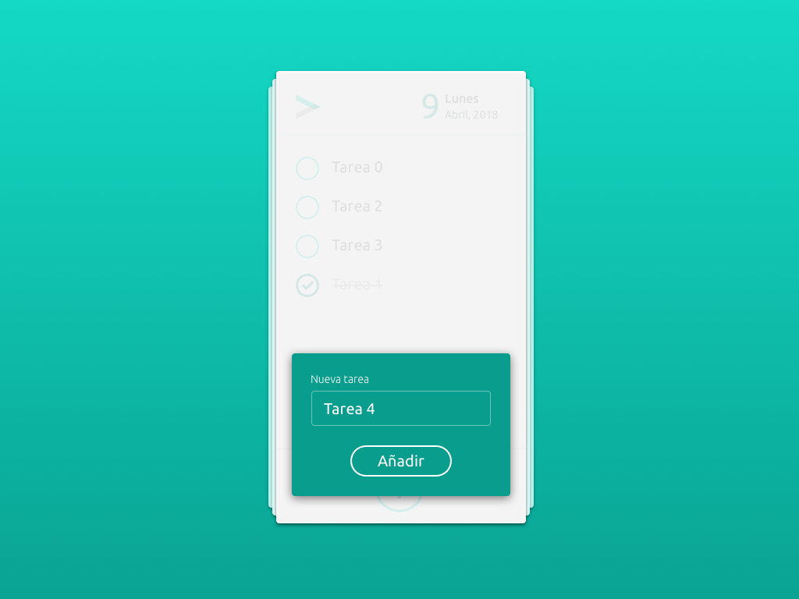

#  TODO List
Ya está bien de desorden y de no llegar a nada, nos vamos a hacer nuestra propia lista de tareas diaria, hombre ya!

## Acciones
- Completar una tarea
- Desmarcar una tarea completada
- Añadir una tarea nueva

## Listado de tareas

## Añade tarea

## Especificaciones
- Ejercicio en JS sin ayuda de frameworks o librerías externas.
- Prioridad: completar las tareas o acciones pedidas.
- Acercarse lo más posible a las guías gráficas ofrecidas.
- La lista de tareas se tiene que almacenar en el Local Storage.
- Tiene que aparecer la fecha actual.
- Todo se desarrolla en la misma página, solo hay 1.

**Tareas:**
- *Completar una tarea:* Hacer clic en una tarea, o en su checkbox, marca la tarea como completada y la coloca al final de la lista
- *Desmarcar una tarea completada:* Hacer clic en una tarea completada, o en su checkbox, marca la tarea como pendiente y la coloca al principio de la lista
- *Añadir una tarea nueva:* muestra una capa donde podremos rellenar el nombre de la tarea y añadirla. Aparecerá en primer lugar.
